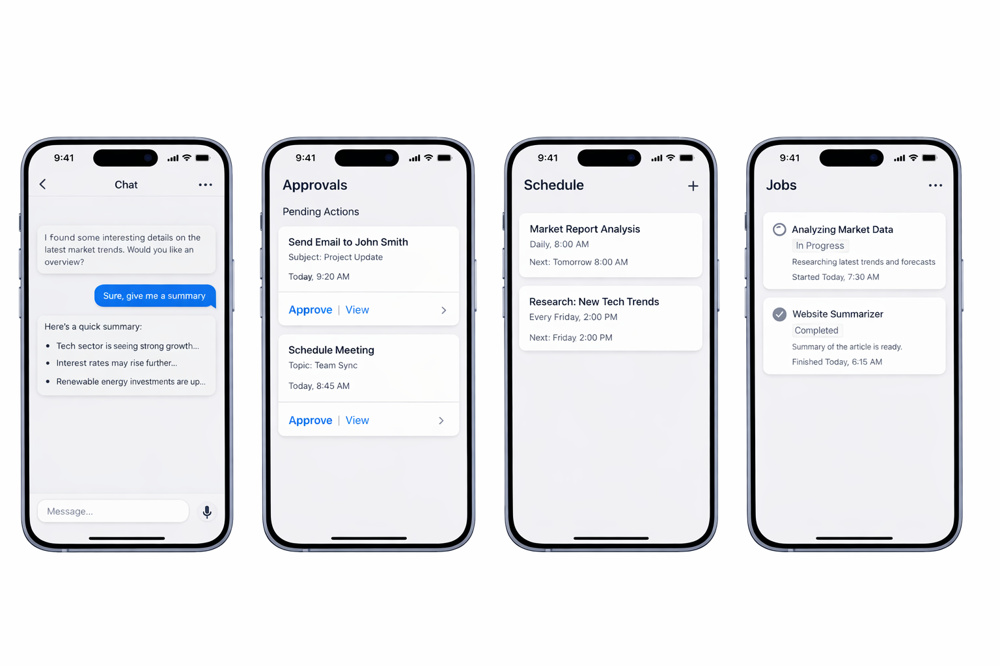

<h1>
  
  Pincer
</h1>

A security-first autonomous assistant with a Go backend and an iOS control app. High autonomy, strict control over side effects. Inspired by [OpenClaw](https://github.com/openclaw/openclaw) and [Nanobot](https://github.com/HKUDS/nanobot).

## Core idea

- The model is untrusted.
- The model may propose actions.
- Trusted code evaluates policy and executes actions.
- External side effects are never silent.

All external actions follow:

`proposed -> approved -> executed -> audited`

- Triggered turns are executed as bounded planner/tool loops, with each tool result written back into context before the final response.

## Why this architecture

Pincer is explicitly designed to mitigate Simon Willison's ["the lethal trifecta"](https://simonwillison.net/2025/Jun/16/the-lethal-trifecta/):

1. Planner and executor are separated.
2. Tool arguments are schema-validated by trusted code.
3. External writes/sends require explicit approval.

## High-level architecture

```text
iOS App
   |
   v
Go Backend (single binary)
   |- Trigger queue (chat/messages, jobs, wakeups, callbacks)
   |- Policy Engine
   |- Approval Queue
   |- Turn Orchestrator (planner -> bounded tool loop)
   |- Action Executor
   |- Job Runner + Scheduler + Wakeups
   |- Tool Registry
   |- SQLite (state + audit)
   |- Provider Client (OpenRouter/OpenAI-compatible)
```

## What's working

- **Device pairing & auth** — pairing codes, opaque bearer tokens (`pnr_` prefix), HMAC-signed, device revocation.
- **Chat with tool use** — threaded conversations via ConnectRPC; the planner calls tools using native OpenAI function calling.
- **Approval-gated execution** — all external actions (e.g. `run_bash`) require explicit user approval before execution. Results are audited and rendered inline in chat.
- **Inline read tools** — READ-classified tools (`web_search`, `web_summarize`, `web_fetch`) execute during the turn without approval; results feed back into planner context.
- **Web fetch with SSRF protections** — `web_fetch` retrieves raw URL content with private/loopback IP blocking, redirect caps, response size limits, and HTML-to-markdown conversion. Prefers Cloudflare Markdown for Agents via content negotiation.
- **Domain capability leases** — first `web_fetch` to an unknown domain requires approval (exfiltration protection); approving grants the domain for the thread, so subsequent fetches execute inline.
- **Live streaming** — turn progress, thinking indicators, and command output stream to the iOS app in real time via `StartTurn`/`WatchThread`.
- **Post-approval turn continuation** — after tool execution, results feed back into the LLM for re-planning. Turns pause at approval gates (`TurnPaused`) and resume automatically after all actions resolve (`TurnResumed`), enabling multi-step adaptive agent behavior.
- **Assistant thinking** — model reasoning (`reasoning_content`) is captured and streamed to the iOS app as `AssistantThinkingDelta` events, rendered as expandable thinking bubbles in the chat timeline.
- **iOS control app** — SwiftUI chat with full markdown rendering (via Textual), approvals tab, device/session management, and settings.
- **Audit log** — every side-effect transition (`proposed → approved → executed`) is recorded and queryable.
- **SOUL-guided planner** — system prompt loaded from `SOUL.md` to shape assistant personality and safety posture.
- **Tailscale support** — optional `tsnet` listener for tailnet-only access; transport only, does not bypass auth.
- **E2E test coverage** — eval tests with real LLM, XCUITest for iOS UI, and reproducible API E2E scripts.

See `PLAN.md` for the full roadmap. Phase 1 (secure core conveyor) is complete; Phase 2 (real integrations) is in progress.

<p align="center">
  
</p>

## Local end-to-end

- `mise run dev`
- `mise run reset-db`
- `mise run ios-simulator-reset-token`
- `mise run ios-run-simulator`
- `mise run ios-run-device`
- `mise run eval`
- `mise run e2e-api`
- `mise run e2e-xcuitest`

Useful overrides:

- `PINCER_BASE_URL`
- `PINCER_DB_PATH`
- `PINCER_AUTH_TOKEN`
- `PINCER_TOKEN_HMAC_KEY`
- `PINCER_E2E_RESET_DB=0`

Database/session defaults:

- `mise run dev` uses `./pincer.db` by default and `PINCER_TOKEN_HMAC_KEY='pincer-dev-token-hmac-key-change-me'`.
- `mise run reset-db` clears `./pincer.db` and associated SQLite journal files.
- `mise run eval` runs eval tests in-process (requires `OPENROUTER_API_KEY`). `mise run e2e-api` is an alias.
- `mise run e2e-xcuitest` starts a fresh backend and runs native XCUITest E2E.

Backend runtime config is now CLI+env via `kong`:

- `go run ./cmd/pincer --help`
- `OPENROUTER_API_KEY` (legacy fallback: `PINCER_OPENROUTER_API_KEY`)
- `PINCER_LOG_LEVEL` (`debug|info|warn|error|fatal`)
- `PINCER_LOG_FORMAT` (`text|json`)

For stream/event debugging, run with:

- `PINCER_LOG_LEVEL=debug PINCER_LOG_FORMAT=text mise run run`

## Run with Tailscale

Pincer embeds a `tsnet` listener — no external `tailscaled` process or `tailscale serve` needed. When `TS_AUTHKEY` is set, the backend registers itself as a Tailscale service (`svc:pincer`) and serves HTTPS on port 443 directly on the tailnet, alongside the normal HTTP listener.

Tailscale is transport only; Pincer still requires normal device pairing and bearer-token auth.

1. Run Pincer with tsnet enabled:
   - `TS_AUTHKEY='tskey-...' PINCER_TOKEN_HMAC_KEY='<strong-random-key>' mise run run`
2. In the iOS app, set `Settings -> Backend -> Address` to your tailnet HTTPS URL (e.g. `https://pincer.<tailnet>.ts.net`).
3. Pair the app as usual; tailnet reachability does not bypass pairing/token auth.

Tailscale-related env/flags:

- `TS_AUTHKEY` — Tailscale auth key; tsnet is only started when this is set.
- `TS_HOSTNAME` — tailnet hostname (default: `pincer`).
- `TS_SERVICE_NAME` — service name registered as `svc:<name>` (default: `pincer`).
- `TS_STATE_DIR` — directory for persistent Tailscale identity state.

## Deploy to Fly.io with embedded tsnet

The Fly deployment embeds `tsnet` in the single Pincer binary — no Tailscale sidecar or extra processes.

1. Create the app (or edit `fly.toml` if `pincer` is unavailable):
   - `flyctl apps create pincer`
2. Create a persistent volume for SQLite and Tailscale state:
   - `flyctl volumes create pincer_data --region syd --size 3 -a pincer`
3. Set required secrets:
   - `flyctl secrets set TS_AUTHKEY='tskey-...' PINCER_TOKEN_HMAC_KEY="$(openssl rand -hex 32)" -a pincer`
   - Optional model access: `flyctl secrets set OPENROUTER_API_KEY='...' -a pincer`
4. Deploy:
   - `flyctl deploy --remote-only -a pincer`
5. Verify the machine is running and check logs for the `tailscale service listening` message:
   - `flyctl logs --no-tail -a pincer`

## Documentation

- `docs/spec.md` - end-state system design and contracts.
- `docs/auth.md` - authentication and device-pairing lifecycle details.
- `docs/protocol.md` - ConnectRPC/protobuf wire contract and streaming event model.
- `PLAN.md` - phased implementation plan and steps.
- `docs/ios-ui-plan.md` - iOS UI/UX planning details.
- `SOUL.md` - assistant phrasing guidance used by the planner when present.
- `AGENTS.md` - repository-specific agent instructions.
